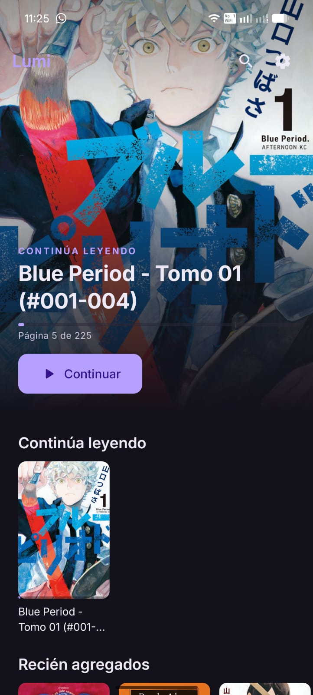
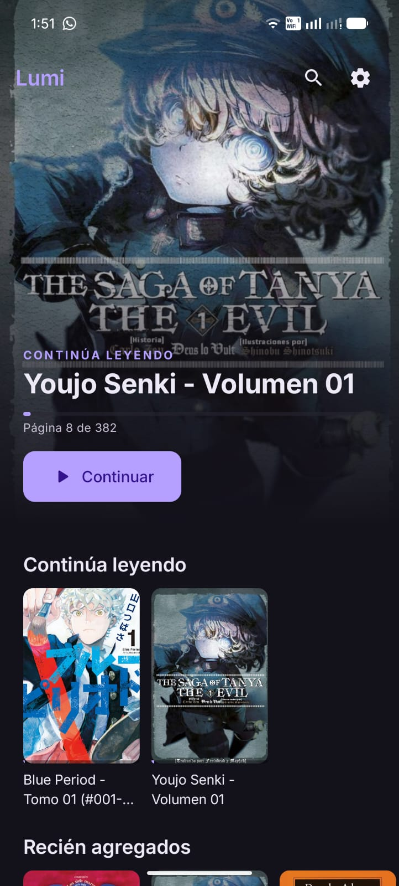
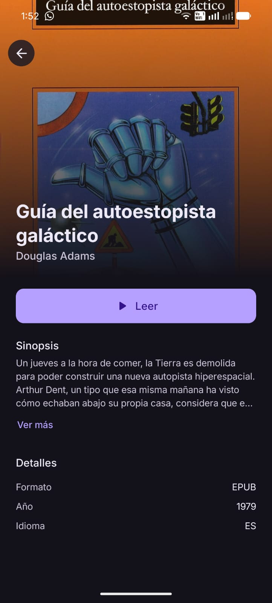
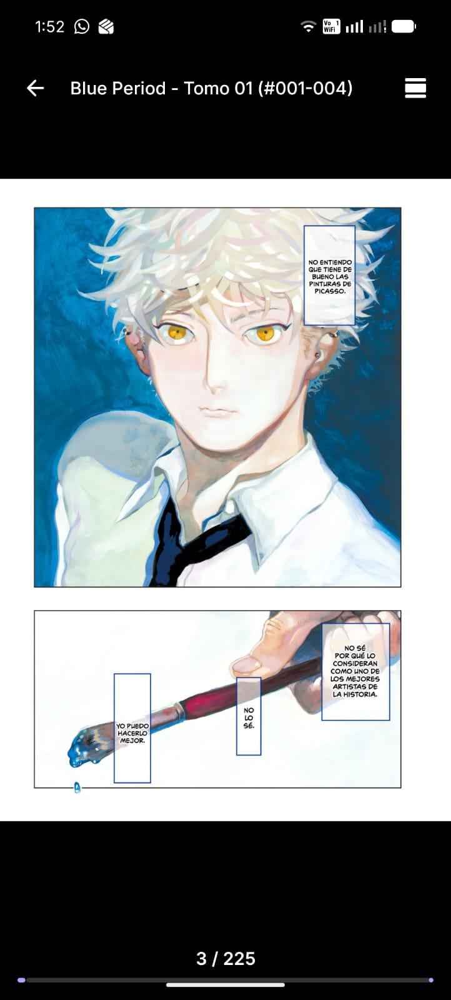

<div align="center">


# Lumi

**Lector de mangas, cómics y libros para Android. Local, privado, gratis, sin anuncios.**

[](LICENSE)
[](https://github.com/AmiiGood/Lumi/releases/latest)
[](https://developer.android.com)
[](https://kotlinlang.org)

[Descargar](https://github.com/AmiiGood/Lumi/releases/latest) · [Reportar bug](https://github.com/AmiiGood/Lumi/issues) · [Apoyar](https://ko-fi.com/amiigood)

</div>

---

## Características

- 📚 **Formatos**: CBZ, CBR, EPUB y PDF
- 🗂️ **Biblioteca inteligente**: escanea la carpeta que elijas, agrupa volúmenes en series automáticamente
- 📖 **Tres modos de lectura**: paginado, webtoon vertical y EPUB con texto fluido
- 🎨 **Diseño cuidado**: home estilo Netflix, modo oscuro, Material You
- 🔒 **100% offline**: nada sale de tu dispositivo. Sin cuentas, sin telemetría, sin anuncios
- 🆓 **Gratis y de código abierto**: GPL-3.0

## Capturas

<div align="center">






</div>

## Instalación

### Opción 1: Google Play
Próximamente.

### Opción 2: APK directo
Descarga el APK desde [Releases](https://github.com/AmiiGood/Lumi/releases/latest) e instálalo manualmente.

## Requisitos

Android 8.0 (API 26) o superior.

## Compilar desde código

```bash
git clone https://github.com/AmiiGood/Lumi.git
cd Lumi
./gradlew assembleDebug
```

El APK queda en `app/build/outputs/apk/debug/`.

## Stack técnico

Kotlin · Jetpack Compose · Hilt · Room · DataStore · Coil · Material 3

## Apoyar el desarrollo

Lumi es y siempre será gratis y sin anuncios. Si te gusta, puedes invitarme un café:

[](https://ko-fi.com/amiigood)

## Licencia

[GPL-3.0](LICENSE)
